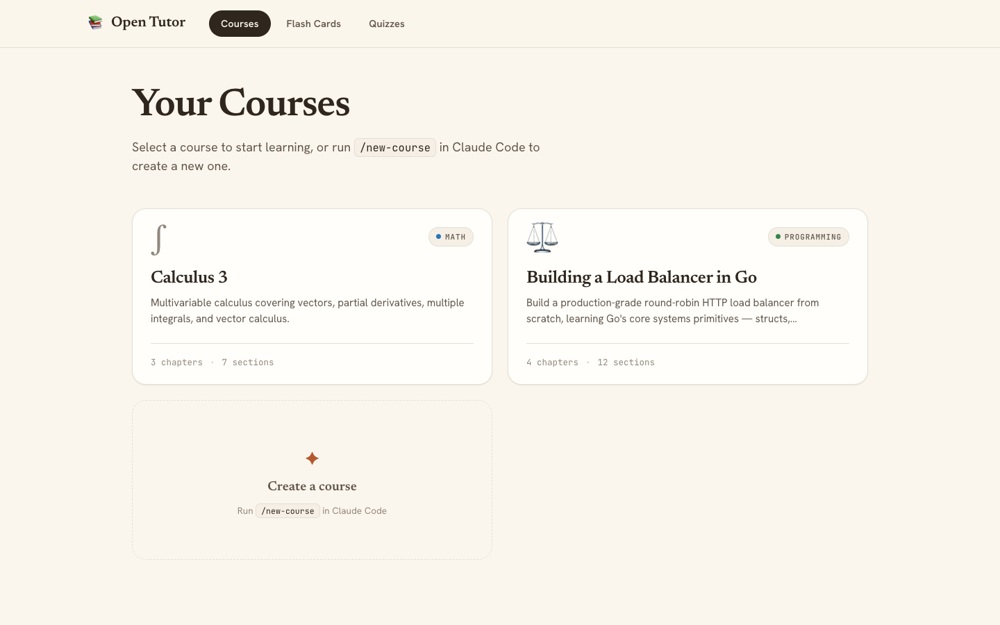
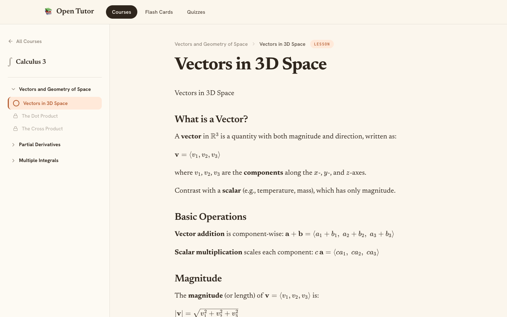
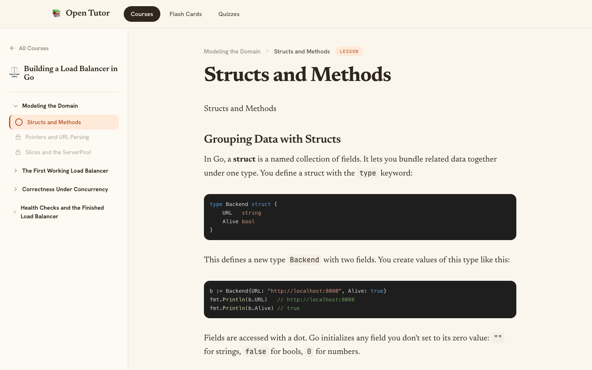
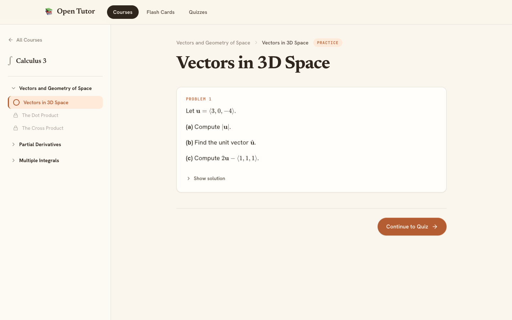
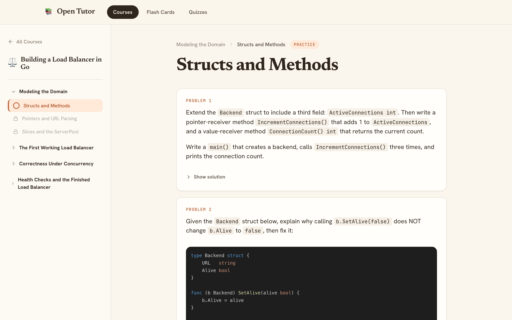
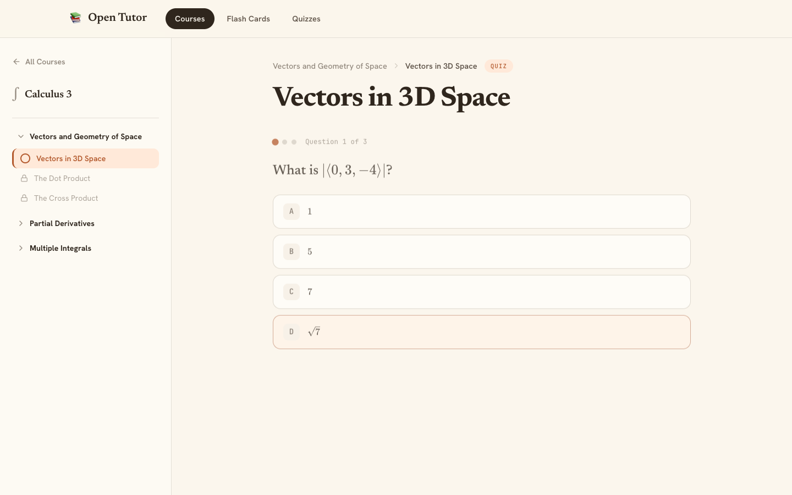
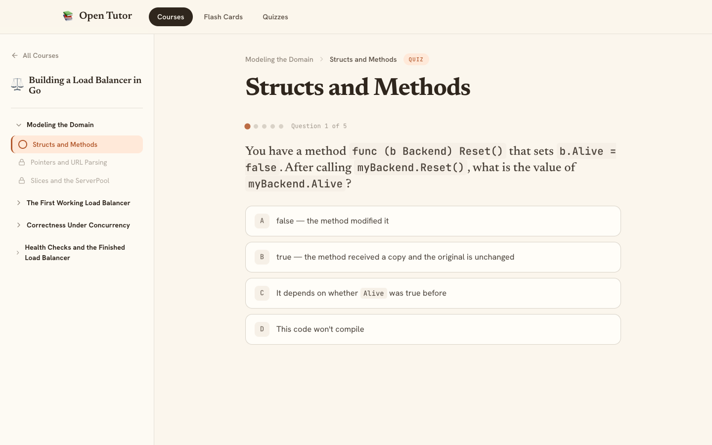

# Open Tutor

A self-hosted, interactive learning environment you run entirely on your own machine.
Install it once, point it at any module repository, and get a clean web UI for courses,
flashcard decks, and quizzes — no accounts, no cloud, no tracking.

Built entirely with [Claude Code](https://claude.ai/code).

📚 **Courses** with structured chapters, rich lessons, and a sidebar that tracks your progress  
🧮 **Math & code** rendered beautifully — LaTeX equations and syntax-highlighted code blocks  
✏️ **Practice problems** with expandable solutions after each lesson  
🧠 **Per-section quizzes** that unlock the next section on a passing score  
🔁 **Recaps** — condensed summaries and fresh quizzes for any course you've finished  
🃏 **Flashcard decks** for active recall  
🧩 **Fully modular** — every course, deck, and quiz is a folder you can add, remove, or share

---

## Screenshots

<table>
  <tr>
    <td align="center" colspan="2"><br/><sub>Course library</sub></td>
  </tr>
  <tr>
    <td align="center"><br/><sub>Calculus 3 — lesson</sub></td>
    <td align="center"><br/><sub>Go Load Balancer — lesson</sub></td>
  </tr>
  <tr>
    <td align="center"><br/><sub>Calculus 3 — practice</sub></td>
    <td align="center"><br/><sub>Go Load Balancer — practice</sub></td>
  </tr>
  <tr>
    <td align="center"><br/><sub>Calculus 3 — quiz</sub></td>
    <td align="center"><br/><sub>Go Load Balancer — quiz</sub></td>
  </tr>
</table>

---

## Quick Start

### Recommended — one-liner install

```bash
curl -fsSL https://raw.githubusercontent.com/shayan-shojaei/open-tutor/main/install.sh | bash
```

This script will:
1. Detect your OS and architecture
2. Download the latest `tutor` CLI binary to `/usr/local/bin`
3. Run `tutor init` to create `~/.tutor/`
4. Run `tutor install` to download the latest web app

Then start the app:

```bash
tutor start          # http://localhost:3000
tutor start --port 8080
```

> **Pin a version** — set `TUTOR_VERSION=v1.2.3` before piping to bash if you need a
> specific release.

---

### Manual install

```bash
# 1. Download the CLI for your platform from the Releases page and put it on $PATH
#    (linux-amd64 | darwin-amd64 | darwin-arm64 | windows-amd64)

# 2. Initialise your local tutor directory (~/.tutor/)
tutor init

# 3. Download the latest web app
tutor install

# 4. Start (default port 3000)
tutor start
```

---

## Configuration

`~/.tutor/config.json` — created by `tutor init`:

```json
{
  "port": 3000,
  "repos": []
}
```

`--port` always takes precedence over the value in the file.

---

## Installing Modules

Modules are courses, flashcard decks, and quizzes. They live in `~/.tutor/modules/`.

### Sample modules

The quickest way to get started is the official sample collection — two full courses
(Calculus 3 and Building a Load Balancer in Go) with lessons, practice problems, and quizzes:

```bash
tutor repo add https://github.com/shayan-shojaei/open-tutor-sample-modules
tutor module install open-tutor-sample-modules calc3
tutor module install open-tutor-sample-modules go-load-balancer
```

Browse the collection: **[open-tutor-sample-modules](https://github.com/shayan-shojaei/open-tutor-sample-modules)**

### From a GitHub repository

```bash
# Register a community module repo
tutor repo add https://github.com/example/tutor-modules

# Browse what's in it
tutor module search calculus

# Install a specific module
tutor module install tutor-modules calculus-101

# List everything you've installed
tutor module list
```

### Sharing your own modules

1. Create a public GitHub repo
2. Add a `tutor-manifest.json` at the root (see format below)
3. Put your modules in `courses/`, `flashcards/`, or `quizzes/` subdirectories
4. Tell users to run `tutor repo add https://github.com/you/your-repo`

**`tutor-manifest.json` format:**

```json
{
  "name": "My Module Collection",
  "description": "Short description",
  "modules": [
    {
      "type": "course",
      "id": "calculus-101",
      "title": "Calculus 101",
      "description": "Limits, derivatives, and integrals"
    }
  ]
}
```

---

## Creating Modules with Claude Code

Open this project in Claude Code and use the built-in skills:

| Skill | What it does |
|-------|-------------|
| `/new-course` | Interviews you and generates a full course (lessons + problems + quizzes) |
| `/new-flash-card` | Creates a flashcard deck from existing content or your notes |
| `/new-quiz` | Creates a standalone quiz |
| `/new-recap` | Generates condensed summaries + fresh quizzes for an existing course |
| `/course-images` | Finds and inserts relevant diagrams from Wikimedia Commons |

All skills write directly to `~/.tutor/modules/` and content appears immediately when you reload the app.

---

## Module Format

### Course

```
~/.tutor/modules/courses/{courseId}/
├── config.json
└── sections/
    ├── {sectionId}.md
    ├── {sectionId}.problems.json
    └── {sectionId}.quiz.json
```

### Flashcard Deck

```
~/.tutor/modules/flashcards/{deckId}/
├── config.json
└── cards.json
```

### Quiz

```
~/.tutor/modules/quizzes/{quizId}/
├── config.json
└── questions.json
```

Full schema definitions are in `web/src/lib/types.ts`.

---

## CLI Reference

```
tutor init                               Create ~/.tutor/ structure
tutor install [--version v1.2.3]         Download the web app
tutor upgrade                            Upgrade to the latest release
tutor start [--port N]                   Serve the web app

tutor module list                        List installed modules
tutor module install <repo> <id>         Install a module
tutor module remove <id>                 Remove a module
tutor module search <query>              Search registered repos

tutor repo add <github-url>              Register a module repo
tutor repo list                          List registered repos
tutor repo remove <alias-or-url>         Unregister a repo
tutor repo update                        Refresh manifest cache
```

---

## Development

```bash
# Web app (dev mode reads from TUTOR_MODULES_DIR or ~/.tutor/modules/)
cd web && npm install && npm run dev

# CLI
cd cli && go build -o tutor . && ./tutor --help
```

---

## License

MIT
